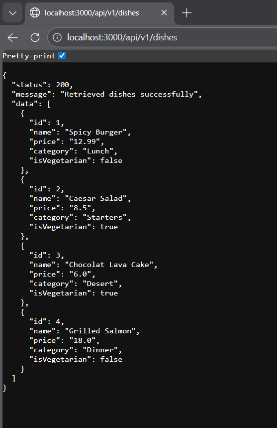

1. Markdown
2. # RESTful API Activity - Jim Rodge M. Opis
3. ## Best Practices Implementation
4. **1. Environment Variables:**
5. - Why did we put `BASE_URI` in `.env` instead of hardcoding it?
6. - Answer: We put the 'BASE_URI' in '.env' instead of hardcoding it because it is easy allows to edit and it follows the security practices.
7. **2. Resource Modeling:**
8. - Why did we use plural nouns (e.g., `/dishes`) for our routes?
9. - Answer: We use plural nouns for our routes to symbolize that it is a collection of data.
10. **3. Status Codes:**
11. - When do we use `201 Created` vs `200 OK`?
12. - Why is it important to return `404` instead of just an empty array or a generic error?
13. - Answer: We use the '201 Created' if a new resource was successfully created while the '200 OK' is used when a request is successful and doesn't create a new resource.
14.
15. **4. Testing:**
16. - (Paste a screenshot of a successful GET request here)
