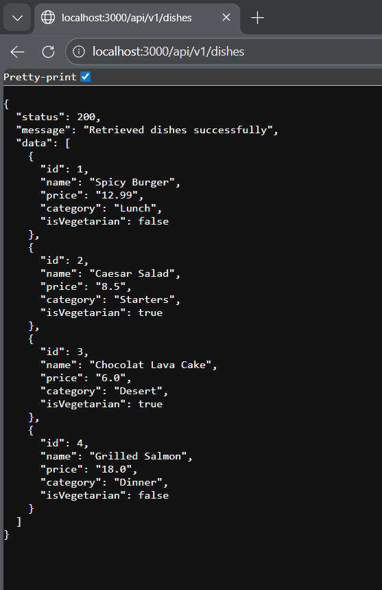

1. Markdown
2. # RESTful API Activity - Jim Rodge M. Opis
3. ## Best Practices Implementation
4. **1. Environment Variables:**
5. - Why did we put `BASE_URI` in `.env` instead of hardcoding it?
6. - Answer: We put the 'BASE_URI' in '.env' instead of hardcoding it because it is easy allows to edit and it follows the security practices.
7. **2. Resource Modeling:**
8. - Why did we use plural nouns (e.g., `/dishes`) for our routes?
9. - Answer: We use plural nouns for our routes to symbolize that it is a collection of data.
10. **3. Status Codes:**
11. - When do we use `201 Created` vs `200 OK`?
12. - Why is it important to return `404` instead of just an empty array or a generic error?
13. - Answer: We use the '201 Created' if a new resource was successfully created while the '200 OK' is used when a request is successful and doesn't create a new resource.
14.
15. **4. Testing:**
16. - (Paste a screenshot of a successful GET request here)

## Why did I choose to Embed the Review / Tag / Log?

Since the Review, Tag, and Log are small and dependent components that weren't required to be present in the parent document, so I decided to embed them.

## Why did I choose to Reference the Chef / User / Guest?

Since the Chef, User, and Guest entities have separate records that can exist independently and may be used again in different documents, I decided to make reference to them. Referencing maintains database normalization and prevents data duplication.

##1. Authentication vs Authorization:
o What is the difference between Authentication and Authorization in our
code?
Answer: Authentication is the process of verifying a user's identity like when entering credentials while authorization is checking the permission if it is allowed to see or perform a specific task.    

##2. Security (bcrypt):
o Why did we use bcryptjs instead of saving passwords as plain text in
MongoDB?
Answer: It is use to secure passwords that can protect from hackers even if the database is compromised.

##3. JWT Structure:
o What does the protect middleware do when it receives a JWT from the
client?
o Answer: The protect middleware first extracts the JSON Web Token from the request header, which is typically the Authorization header. It then verifies that the token is authentic and hasn't expired using a secret key. If the middleware decodes the user data in the token and adds it to the request object, the user can access protected routes. If the token is missing or invalid, the middleware blocks access and returns an authentication error.